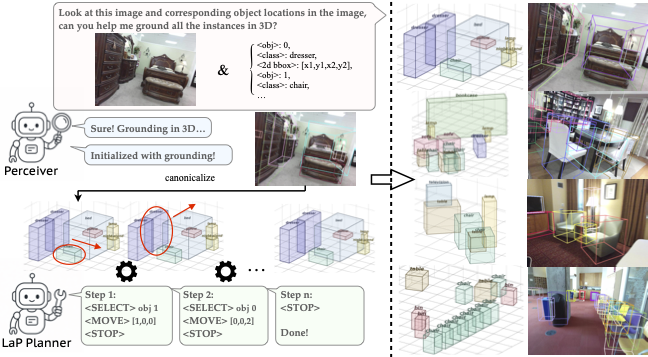
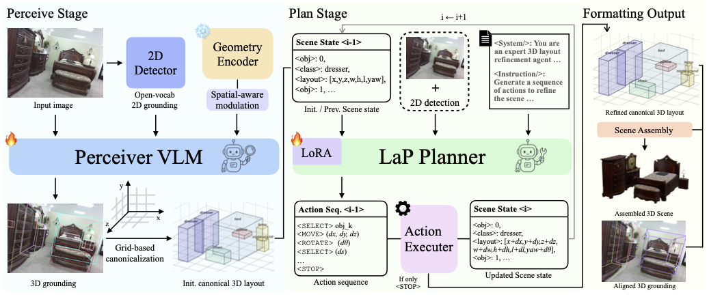
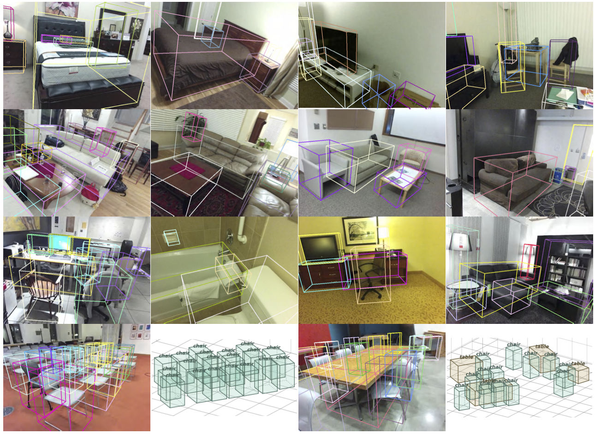
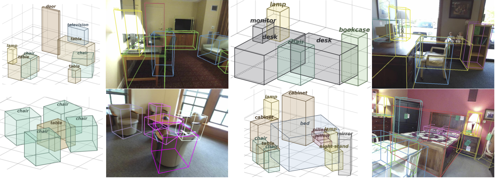
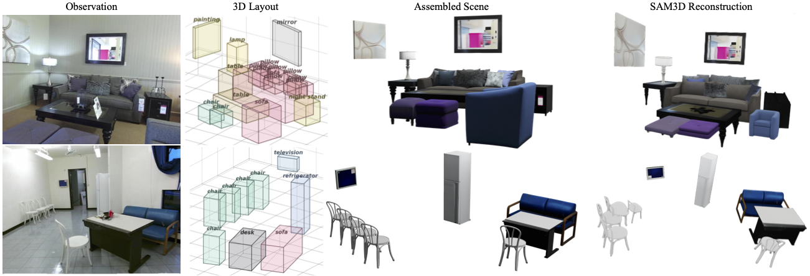

<div align="center">
<h2>Perceive-then-Plan: Layout-as-Policy for Monocular 3D Scene Layout Estimation</h2>
<!-- <p><b>ECCV 2026</b></p> -->
<p>
<a href="https://colezwhy.github.io/" target="_blank">Junwei Zhou</a>,
<a href="https://yuwingtai.github.io/" target="_blank">Yu-Wing Tai</a>
</p>
<p>Dartmouth College</p>
</div>

>**TL;DR**: <em> We propose a perceive-then-plan framework with two VLMs (Perceiver and LaP Planner) for monocular 3D layout estimation, enabling both visual alignment and physical plausibility.</em>

<p align="center">
  <a href="https://colezwhy.github.io/perceivethenplan/">
    
  </a>
<a href="https://arxiv.org/abs/2605.25326">
  
</a>
    <a href="#">
    
  </a>
</p>

<div align="center">

</div>

Official implementation for paper 'Perceive-then-Plan: Layout-as-Policy for Monocular 3D Scene Layout Estimation'.

In this work, we formulate monocular 3D layout estimation as a perceive-then-plan problem with vision-language models, where a Perceiver first grounds the 3D objects and then a Planner iteratively refines the scene hypothesis through actions that improve physical plausibility while preserving consistency with the input image.

## Updates and TODOs
- ✔️ 06/15/2026: Initialize the project page.
- 🔲 TODO: The code will soon be released upon acceptance. Please stay tuned!


## Method 
<p align="center">
  
</p>

<p align="center">
The Perceiver grounds 3D boxes from the input image. A canonicalized, grid-based representation is then iteratively refined by the LaP Planner, which treats each layout as a structured state and selects discrete actions (translate, rotate, rescale) via a learned policy until convergence. The final layout supports both scene assembly (digital twin) and camera-space projection (3D grounding).
</p>

## Results
<p align="center">
  
</p>

<p align="center">
  3D grounding results produced by our Perceiver 8B.
</p>

<div align="center">
  <table>
    <tr>
      <td align="center"></td>
      <td align="center"></td>
    </tr>
    <tr>
      <td align="center"></td>
      <td align="center"></td>
    </tr>
    <tr>
      <td align="center"></td>
      <td align="center"></td>
    </tr>
  </table>
</div>

<p align="center">
  Demonstration of our Planner's action-based layout refinement.
</p>

<p align="center">
  
</p>

<p align="center">
  More 3D scene layouts estimated by our whole pipeline.
</p>

<p align="center">
  
</p>

<p align="center">
  Scene Assembly Results, compared to SAM3D reconstructed scenes.
</p>

## Citation
Here is the bibtex reference. If you find our work interesting or useful, please give us a :star: or cite our paper!
```
@misc{zhou2026perceivethenplan,
      title={Perceive-then-Plan: Layout-as-Policy for Monocular 3D Scene Layout Estimation}, 
      author={Junwei Zhou and Yu-Wing Tai},
      year={2026},
      eprint={2605.25326},
      archivePrefix={arXiv},
      primaryClass={cs.CV},
      url={https://arxiv.org/abs/2605.25326}, 
}
```
