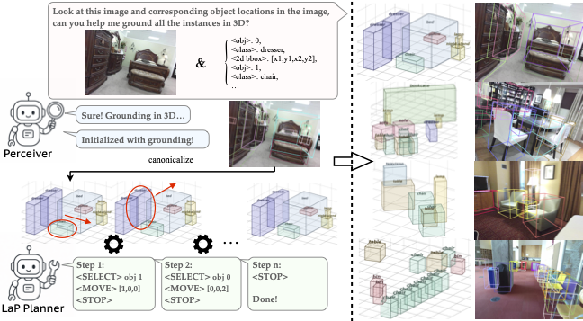
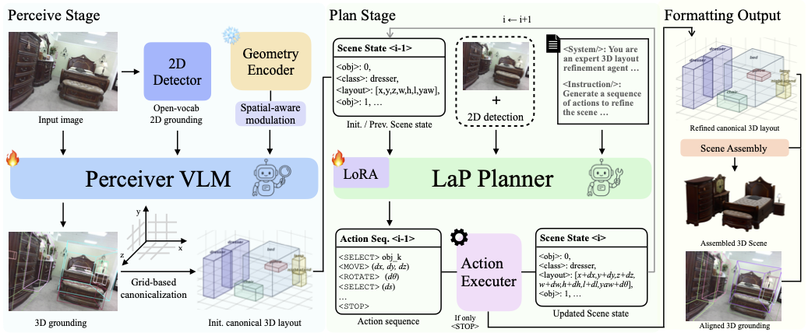

<div align="center">
<h2>Perceive-then-Plan: Layout-as-Policy for Monocular 3D Scene Layout Estimation</h2>
<p><b>NeurIPS 2026</b></p>
<p>
<a href="https://colezwhy.github.io/" target="_blank">Junwei Zhou</a>,
<a href="https://yuwingtai.github.io/" target="_blank">Yu-Wing Tai</a>
</p>
<p>Dartmouth College</p>
</div>

>**TL;DR**: <em> We propose a perceive-then-plan framework with two VLMs (Perceiver and LaP Planner) for monocular 3D layout estimation, enabling both visual alignment and physical plausibility.</em>

<p align="center">
  <a href="https://neurips.cc/">
    
  </a>
  <a href="https://colezwhy.github.io/perceivethenplan/">
    
  </a>
<a href="https://arxiv.org/abs/2605.25326">
  
</a>
    <a href="#">
    
  </a>
</p>

<div align="center">

</div>

Official implementation for paper 'Perceive-then-Plan: Layout-as-Policy for Monocular 3D Scene Layout Estimation'.

In this work, we formulate monocular 3D layout estimation as a perceive-then-plan problem with vision-language models, where a Perceiver first grounds the 3D objects and then a Planner iteratively refines the scene hypothesis through actions that improve physical plausibility while preserving consistency with the input image.

## 📢 Updates and TODOs
- 🎉 Perceive-then-Plan is accepted to **NeurIPS 2026**!
- ✅ 06/15/2026: Initialize the project page.
- ⏳ TODO: Release Stage 1 (Perceiver) code.
- ⏳ TODO: Release Perceiver checkpoints.
- ⏳ TODO: Release Stage 2 (LaP Planner) code.

## 🧭 Method
<p align="center">
  
</p>

<p align="center">
The Perceiver grounds 3D boxes from the input image. A canonicalized, grid-based representation is then iteratively refined by the LaP Planner, which treats each layout as a structured state and selects discrete actions (translate, rotate, rescale) via a learned policy until convergence. The final layout supports both scene assembly (digital twin) and camera-space projection (3D grounding).
</p>

## 📝 Citation
Here is the bibtex reference. If you find our work interesting or useful, please give us a :star: or cite our paper!
```
@inproceedings{zhou2026perceivethenplan,
  title={Perceive-then-Plan: Layout-as-Policy for Monocular 3D Scene Layout Estimation},
  author={Zhou, Junwei and Tai, Yu-Wing},
  booktitle={Advances in Neural Information Processing Systems},
  year={2026}
}
```

## 🙏 Acknowledgements
We thank the authors of these great projects. Many thanks!

- 🤖 [Qwen3-VL](https://github.com/QwenLM/Qwen3-VL)
- 🧩 [VG-LLM](https://github.com/LaVi-Lab/VG-LLM)
- 📐 [VGGT](https://github.com/facebookresearch/vggt)
- 🏠 [Omni3D](https://github.com/facebookresearch/omni3d)
